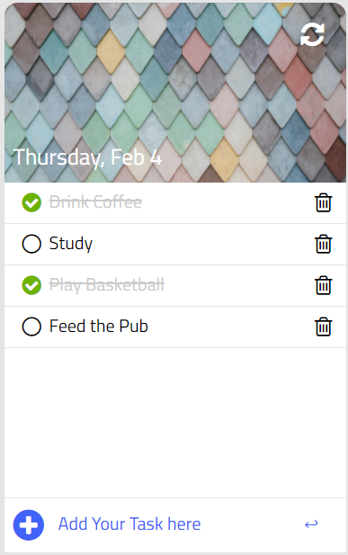

<h1> TO-DO APP JAVASCRIPT</h1>

<h3>&#8595;   &#8595;  Click Here  &#8595;   &#8595;</h3>
<button>
<h2>
<a href="https://haamzahm.github.io/todo-app-javascript/">LIVE DEMO</a></h2></button>

<b>

Todolist: The to do list to organize work & life
</b>

